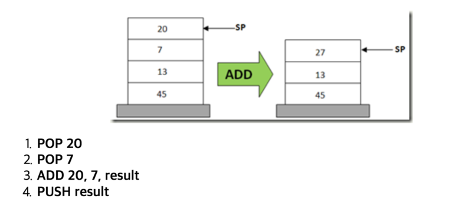
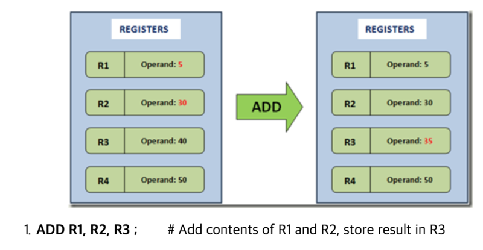

## 가상 머신(VM)

가상 머신(VM : Virtual Machine)은 물리적인 CPU에 의해 처리되는 동작을 흉내낼 수 있어야 한다. 따라서 일반적으로 VM은 아래의 개념들을 구현(포함)해야 한다.

* 소스 코드를 VM이 실행할 수 있는 바이트 코드로 변환
* 명령어와 피연산자를 포함하는 데이터구조
* 함수를 실행하기 위한 콜스택
* 다음 실행할 명령어를 가리키는 IP(Instruction Pointer)
* 가상 CPU
  * Fatch
    * IP가 가리키는 명령어를 가져온다
  * Decode
    * 가져온 명령어를 디코드(해석)한다.
  * Execution
    * 디코딩된 명령어를 수행한다

일반적으로 위 개념을 구현하는 방법은 크게 2가지가 존재한다.

* 스택 기반의 VM
* 레지스터 기반의 VM

두 방법은 피연산자를 저장하고 다시 가져오는 메커니즘이 다르다. JVM이 바로 스택 기반의 VM이다

## 스택 기반의 VM

JVM과 Net CLR이 스택 기반의 VM이다.

예를 들어 `13 + 20 + 7` 을 계산한다고 하자. CPU의 덧셈 연산은 2개의 피연산자를 다루므로 `20 + 7` 를 계산한 결과를 `13` 과 더해야만 한다. 스택 기반의 VM은 이 결과를 바로 스택에 저장한다.

위 그림을 보면, 20과 7을 더하기 위해서 두 피연산자를 스택에서 꺼낸다. 꺼낸 결과를 가지고 계산한 뒤에 다시 결과를 스택에 넣는 것을 알 수 있다.

즉, 스택 기반의 VM은 피연산자를 저장하고 가져올 때 스택을 활용한다. 스택 기반의 VM의 장단점은 아래와 같다.

* 장점
  * 하드웨어에 덜 의존적이다
    * 하드웨어(레지스터, CPU)에 대해 직접적으로 다루지 않으므로 다양한 하드웨어에서 쉽게 VM을 구현할 수 있다
  * 명령어의 길이가 짧아진다
    * 다음 피연산자는 스택의 TOP에 존재하므로 피연산자의 메모리 주소를 사용할 필요가 없다. 따라서 명령어에 메모리 주소를 적을 필요가 없으므로 명령어의 길이가 짧아진다
* 단점
  * 명령어의 수가 많아진다
  * 스택을 사용하는 오버헤드가 존재한다
  * 명령어 최적화를 할 수 없다

## 레지스터 기반의 VM

Lua VM, Dalvik VM이 바로 레지스터 기반의 VM이다.

예를 들어 `5 + 30 + 40` 을 계산한다고 하자. CPU의 덧셈 연산은 2개의 피연산자를 다루므로 `20 + 7` 를 계산한 결과를 `13` 과 더해야만 한다. 레지스터 기반의 VM은 피연산자를 레지스터에서 가져와서 계산하고, 결과를 다시 레지스터에 저장한다.

즉, 레지스터 기반의 VM은 피연산자를 레지스터에서 가져와서 계산한 뒤 다시 레지스터에 저장한다. 레지스터 기반의 VM의 장단점은 다음과 같다.

* 장점
  * 명령어의 수가 적다
    * POP, PUSH 없이 하나의 명령어로 계산할 수 있으므로 명령어의 수가 적어진다
  * 스택을 사용하지 않아 스택에 대한 오버헤드가 없다
  * 스택 기반에서는 할 수 없는 명령어 최적화를 할 수 있다
    * 코드에 동일한 연산식이 존재하는 경우 처음 계산한 결과를 레지스터에 넣어서 여러번 쓸 수 있다. 따라서 식 계산에 들어가는 비용을 최적화할 수 있다
* 단점
  * 명령어의 크기가 커진다
    * 명령어에 피연산자의 메모리 주소를 명시해야 하므로 명령어의 길이가 길어진다

[논문](https://www.usenix.org/legacy/events/vee05/full_papers/p153-yunhe.pdf)에 따르면 레지스터 기반의 VM이 스택 기반 VM 보다 명령어 수는 47% 적지만 명령어 사이즈는 25% 크다고 한다.

또한 더 많은 VM 명령어를 가져옴으로써 실제 컴퓨터 부하를 명령어 당 1.07% 줄일 수 있다고 한다.

하지만, VM 명령어 디스패치가 실제 컴퓨터 부하보다 훨씬 비싸다는 점을 생각하면 코드 사이즈를 조금 늘리더라도 명령어 수를 줄이는 것이 훨씬 효율적이라고 한다

실제로 벤치마크를 돌렸을 때 레지스터 기반 VM이 스택 기반 VM 보다 32.3%만큼 줄어든 시간이 걸린다고 한다.

그럼에도 불구하고 Java가 스택 기반의 VM을 사용하는 이유는 스택 기반의 VM은 레지스터 기반의 VM보다 하드웨어(레지스터, CPU)에 적게 의존하기 때문이다. 레지스터 기반 VM은 연산 결과를 CPU의 레지스터에 저장하므로 구현이예를 들면 레지스터의 개수, 레지스터의 사이즈 등에 의존할 수 밖에 없다.

하지만 스택 기반 VM은 스택 포인터를 사용해 상대적으로 하드웨어에 독립적인 구현을 할 수 있고 따라서 VM을 다양한 하드웨어에서 구현하기 쉽다.

OS와 상관없이 JAVA 프로그램을 실행하기 위해서는 여러 OS, 하드웨어 위에서 돌아가는 JVM을 구현해야 했기 때문에 스택 기반의 VM이 최적이었을 것이다.

