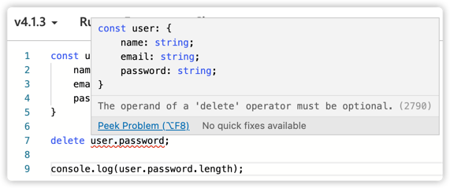

## 프로퍼티 지우기

우리는 보통 `delete` 키워드를 사용해서 오브젝트의 프로퍼티를 지운다. `delete`의 문제는 이 동작이 객체를 수정한다는 것이다. 즉, 원본 객체를 바꿔버리며 이는 원하지 않는 사이드 이펙트가 생길 수도 있다.

우리에게 익숙한 `delete` 대신 구조 분해 할당을 사용하면 같은 효과를 얻으면서도 부작용을 막을 수 있다.

## 구조 분해 할당

구조 분해 할당은 우리가 변수를 선언할 때 사용할 수 있는 일종의 `Syntatic Sugar`다. 일반적으로 아래와 같이 사용한다.

```typescript
const user = {
    name : "길동이",
    email : "asdf@naver.com",
    password : "It's Secret!"
}

const {name, email} = user;
console.log(name, email) // 길동이 asdf@naver.com
```

자세한 설명은 [여기](https://poiemaweb.com/es6-destructuring)를 참고하자.

이 구조 분해 할당이 `rest parameter`와 함께 사용되면 아래와 같은 동작이 가능하다.

```typescript
const {name, ...rest} = user;
console.log(name, rest) // 길동이 {email: "asdf@naver.com", password: "It's Secret!"}
```

`...` 연산자는 우리가 원하는 값을 제외하고 남은 값들을 얻어내는데 사용될 수 있다. 다르게 말하면, 우리가 원하는 값을 제외한 객체를 얻어낼 수 있다.

웹 사이트에 사용자 정보를 보여주기 위해서 `user` 객체를 반환해야 된다고 생각해보자. 당연히 우리는 `password` 프로퍼티를 넘겨줘서는 안된다. 일반적으로는 아래와 같은 방법을 사용햇었을 것이다.

```typescript
delete user.password
console.log(user) // {name: "길동이", email: "asdf@naver.com"}
```

하지만 이는 위에서 말했듯이 원본 객체가 수정된다는 문제가 존재한다. 하지만 우리는 이제 아래와 같은 방법을 사용할 수 있다!

```typescript
const {password : temp, ...userWithoutPassword} = user
console.log(userWithoutPassword) // {name: "길동이", email: "asdf@naver.com"}
console.log(user) // {name: "길동이", email: "asdf@naver.com", password: "It's Secret!"}
```

원본 객체는 건드리지 않고 프로퍼티를 제거한 객체를 얻을 수 있다.

```typescript
const parameterName = "password";

const {[parameterName] : temp, ...userWithoutPassword} = user
console.log(userWithoutPassword) // {name: "길동이", email: "asdf@naver.com"}
console.log(user) // {name: "길동이", email: "asdf@naver.com", password: "It's Secret!"}
```

위와 같이 변수를 이용해서 제외할 파라미터를 선택할 수도 있다. `delete`보다 더 자유롭게 사용할 수 있으면서도 더욱 안정적인 방법이다.

## Typescript

간단한 `delete` 대신  구조 분해 할당을 사용하면 더 좋은 점은 단순히 객체를 수정하지 않는다는 점밖에 없을까? 난 Typescript를 사용한다면 `delete` 대신 구조 분해 할당을 사용하는 것을 추천한다.

`Typescript`를 사용하는 이유 중에는 타입 안정성이 있다. 미리 타입을 정의해놓음으로써 우리는 객체에 해당 속성이 존재한다고 확신할 수 있고 객체의 속성을 변경함으로써 오는 부작용을 줄일 수 있다. 하지만 아래와 같은 경우는 어떨까?

````typescript
const user = {
    name : "길동이",
    email : "asdf@naver.com",
    password : "It's Secret!"
}

delete user.password;

console.log(user.password.length);
````

우선, `tsc`를 사용해서 컴파일 하면 결과는 아래와 같다.

```typescript
var user = {
    name: "길동이",
    email: "asdf@naver.com",
    password: "It's Secret!"
};
delete user.password;
console.log(user.password.length);
```

하지만 실행하면 아래와 같은 오류가 발생한다.

```
console.log(user.password.length);
                          ^
TypeError: Cannot read property 'length' of undefined
```

우리는 분명 타입 안정성을 얻기 위해서 `Typescript`를 사용했고 컴파일 과정에서도 별다른 오류를 얻지 못했다. 하지만 실제로 실행해보면 프로퍼티가 존재하지 않는다는 오류가 발생한다.

이는 결국 `delete`가 원본 객체를 수정하기 때문에 생긴 일이다.

```typescript
const user = {
  name: "길동이",
  email: "asdf@naver.com",
  password: "It's Secret!",
};

const { password: temp, ...userWithoutPassword } = user;

console.log(userWithoutPassword.password.length);
```

하지만 구조 분해 할당을 사용한다면 어떨까? 컴파일러는 `userWithoutPassword`에 `password`가 존재하지 않는다는 사실을 알고있다. 따라서 아래와 같은 오류가 발생한다.

```
test.ts:9:33 - error TS2339: Property 'password' does not exist on type '{ name: string; email: string; }'.
console.log(userWithoutPassword.password.length);
                                  ~~~~~~~~
Found 1 error.
```

즉, 구조 분해 할당을 사용하면 원본 객체를 수정하지 않을 수 있을뿐만 아니라 컴파일러가 타입을 추론하는데도 도움을 줄 수 있다.

실제로 Typescript 4.0 버전 이상부터는 `delete` 연산자를 사용하면 경고를 내보낸다. [4.0 공식 문서](https://devblogs.microsoft.com/typescript/announcing-typescript-4-0-beta/#breaking-changes)

따라서 `delete` 대신 타입적으로 안정된 구조 분해 할당을 사용해서 프로퍼티를 제외하는 것이 좋을 것 같다.


